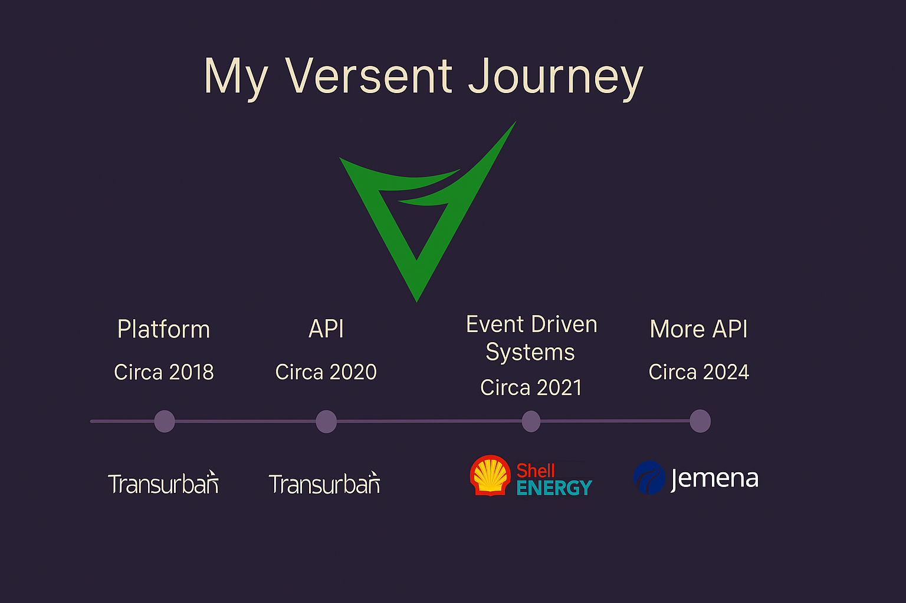
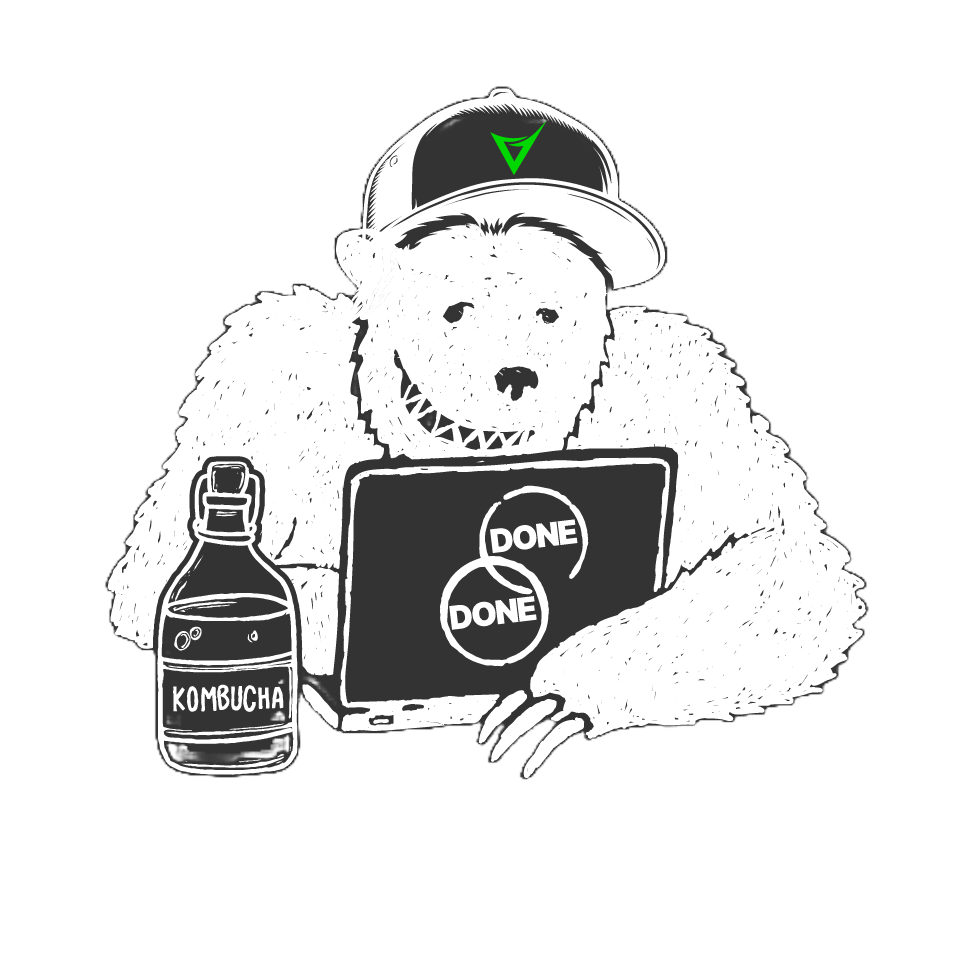

<!-- Slide 1 -->

# <!--fit--> From **Terminal** to **Tailwind**

<!-- Speaker Notes: -->
<!-- Kick off with a smile. -->
<!-- “Hi everyone, I’m Sriram — a backend engineer who somehow ended up touching Tailwind and JSX. This is the story of how that happened — not intentionally — but by stumbling, learning, and laughing along the way.” -->

---

<!-- Slide 1.5 - Introduction -->
<!-- _class: lead _ -->

  

    Hi, I'm   Sriram
  

  

    
  

---

<!-- Slide 2 -->

## Soooooo many **frameworks**

# <i> Too **fast** </i>

Requires pixel perfection

# <!--fit--> Not for **me**

<!-- Speaker Notes: -->
<!-- “You know the meme: new JS framework every week. As a backender, this felt exhausting and mysterious. Why does everyone care about pixels? I just wanted to ship something that worked. I once memorized how to center a div just for interviews… not because I understood it!” -->

---

<!-- Slide 3 -->
<!-- _class: lead _ -->

  <h1>Blogger</h1>
  Carousels.
  <h1>Autoplay music</h1>

<!-- Speaker Notes: -->
<!-- “This was my actual first frontend project — editing Blogger templates, adding music, carousels, making it all very… chaotic. But it was fun. And unknowingly, this was my first exposure to web UI.” -->

---

<!-- Slide 4 -->
<!-- _class: lead _ -->

# <!--fit--> 👉 frontend by ✍️ tests.

<!-- Speaker Notes: -->
<!-- “Fast forward a few years, I’m working with Behat, testing interfaces with CSS selectors. Technically touching the frontend... with a very long stick. I wasn’t designing, just verifying if stuff didn’t explode.” -->

---

<!-- Slide 5 -->

  
Servers   YAML

  
&gt;

  
✨Styling✨  ✨CSS✨

<!-- Speaker Notes: -->
<!-- “I thrived in infra land. Give me a terminal, logs, or Ansible — I’m happy. Styling though? Absolute chaos. Font-weight: 500? 600? Bold? Help. YAML made more sense than CSS to me.” -->

---

<!-- Slide 6 -->

<!-- Speaker Notes: -->
<!-- “At Versent, I started in a platform team — Jenkins, pipelines, cloud infra. Then APIs at Transurban. Then events at Shell Energy. This slow but steady shift brought me closer to apps — and frontend wasn’t optional anymore.” -->

---

<!-- Slide 7 -->

# <!--fit--> Altcoin Weekend 💸

  
$19K
 <a href="https://astrokitty.pages.dev" class="demo-button" target="_blank">Live Demo</a>

<!-- Speaker Notes: -->
<!-- “In a burst of chaotic motivation, my friends and I built an altcoin site using Vue. In one weekend we made $19K. We were stunned. Vue was overkill for landing pages, but the project was alive and real!” -->

---

<!-- Slide 8 -->

# Crafty Live Demo

> "I didn't do much of the frontend here, but I helped build out certain features."

<!-- Speaker Notes: -->
<!-- “Crafty was a project I helped on — not as the main frontend dev, but I contributed components and learned how modern React setups worked. A real team effort. And I started appreciating things like design systems.” -->

---

<!-- Slide 9 -->
<!-- _class: lead _ -->
<!--fit-->

# **AI Helped A Lot**

_Copilot._ _ChatGPT_. _Claude_. _My 24/7 pair buddy._

<!-- Speaker Notes: -->
<!-- “Let’s be honest — frontend is hard. Hooks? State? Tailwind? Having Copilot and ChatGPT was like having a 24/7 teammate. I didn’t always understand everything I pasted, but I could ask why — and that’s powerful.” -->

---

<!-- Slide 10 -->
<!-- _class: lead _ -->
<!--fit-->

# <!--fit--> Still not **frontend-y**…

## _but I get it now (**kinda**). And I’m not afraid._

<!-- Speaker Notes: -->
<!-- “I’m still not a pixel-perfect frontend dev. But I’m not afraid to try anymore. And that shift in mindset is everything. I don’t need to master it all — just stay curious and build.” -->

---

<!-- Slide 11 -->

  
DevJam = low stakes, high growth

  
Theme: Agentic AI

  
Try anything. AI has your back.

<!-- Speaker Notes: -->
<!-- “This talk, this whole journey, happened because I said yes to DevJam. It’s a safe space to try new tech, take risks, and just make something weird and cool. Seriously, get involved.” -->

---

<!-- Slide 12 -->
<!-- _class: lead _ -->
<!--fit-->

## <!--fit--> Curiosity + **Caffeine** + Copilot = 🚀

<!-- Speaker Notes: -->
<!-- “Frontend still scares me a bit. But with curiosity, caffeine, and Copilot — you can build real things. Even accidentally. Like an altcoin site. Or a live demo. Or this talk.”

I know people on the bench might feel anxious about not knowing what to do next. One idea is to use this time to explore tech you aren’t typically exposed to. Maybe try earning a certification or building something in that domain. It’s a great way to grow and stay engaged while waiting for your next opportunity.
